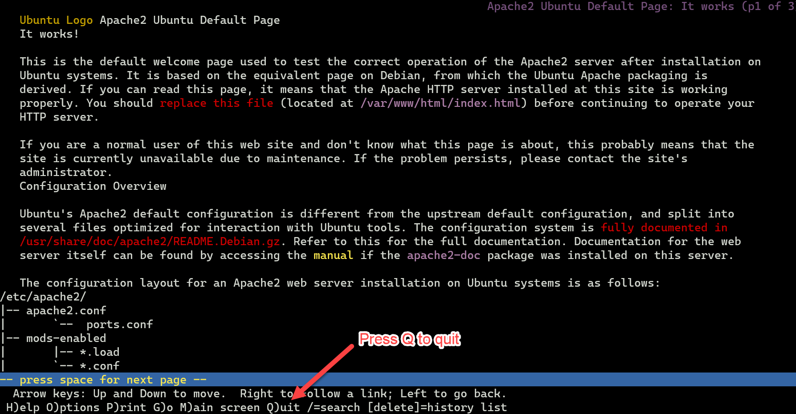
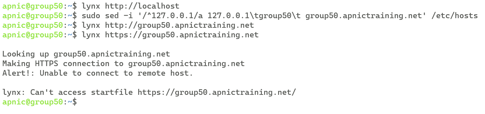
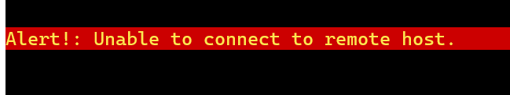
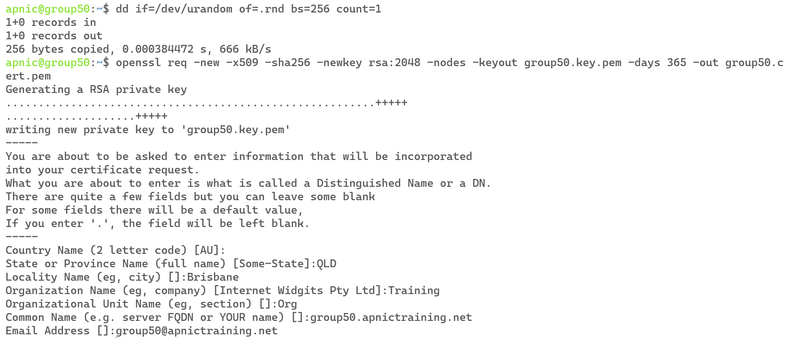
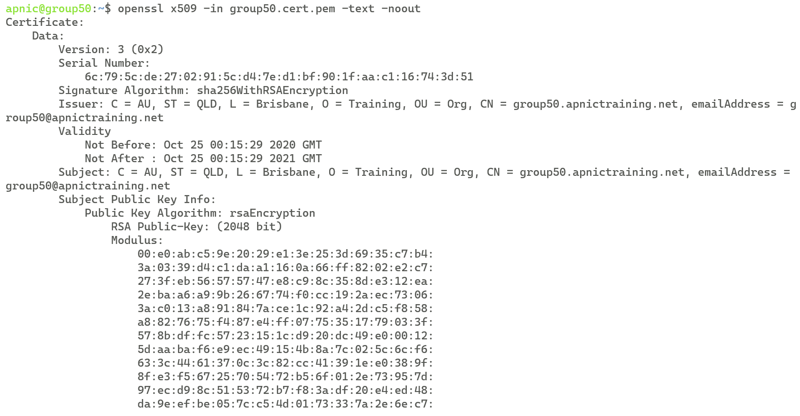
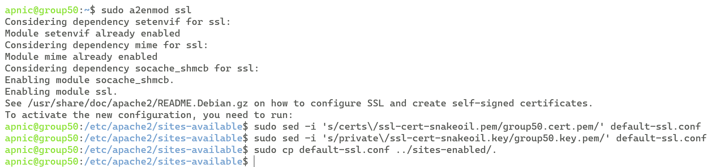
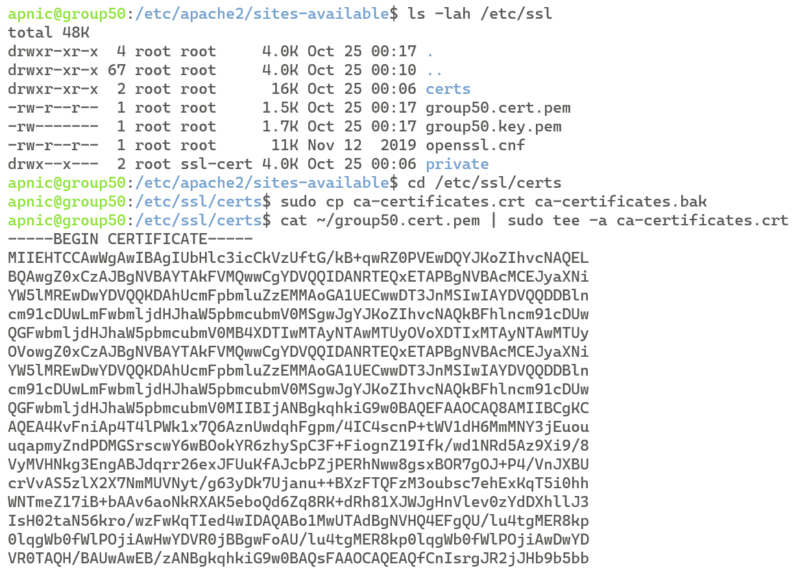
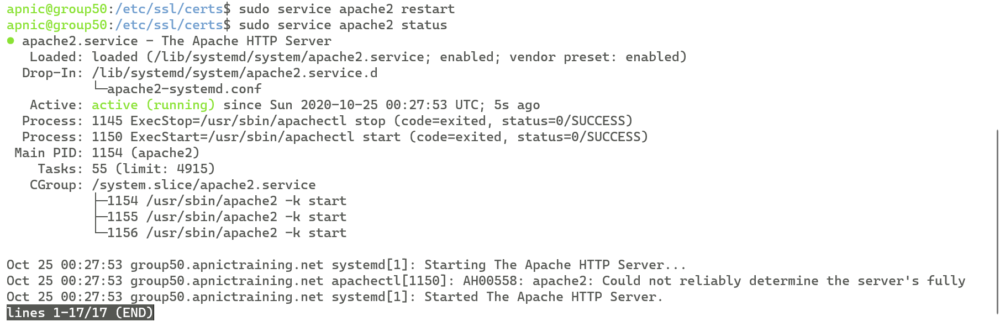
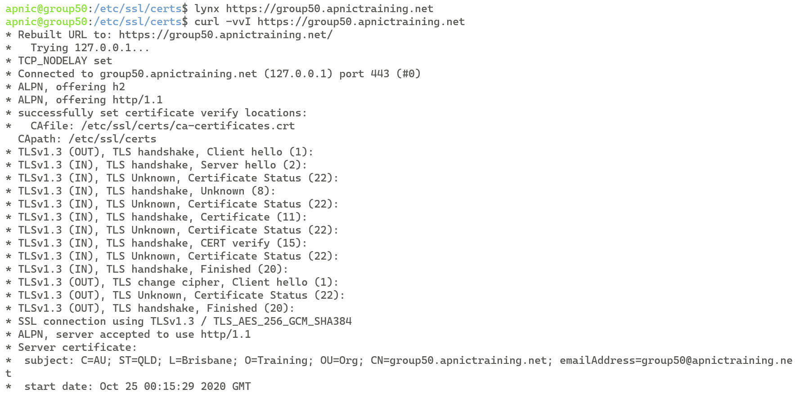
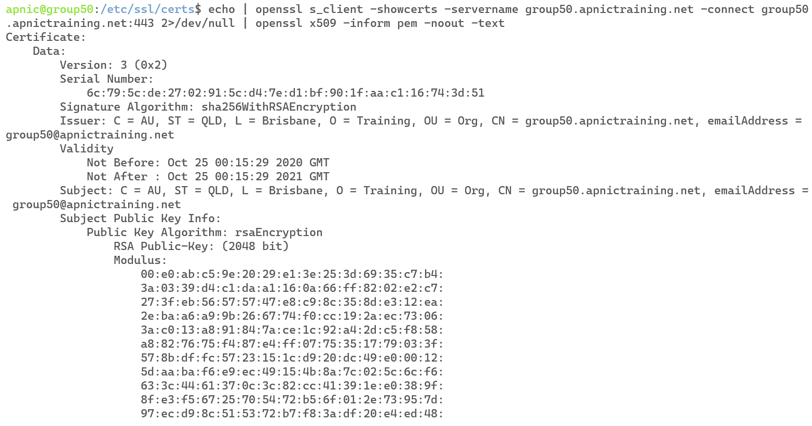

# LAB :: Secure HTTP traffic with SSL Certificate

* In this example we are using apnictraining.net as domain name.  
* \# super user command.  
* $  normal user command.  
* Username `apnic` and password `training`.


**Topology** 
	
	[group1.apnictraining.net] [192.168.30.1]
	[group2.apnictraining.net] [192.168.30.2]
	......  
	[group10.apnictraining.net] [192.168.30.10]  
	[group11.apnictraining.net] [192.168.30.11]  
	......  
	[group20.apnictraining.net] [192.168.30.20]  
	[group21.apnictraining.net] [192.168.30.21]  
	......
	[group30.apnictraining.net] [192.168.30.30]  

In this lab you will generate a self-signed SSL certificate and apply it to an apache webserver.

## Lab Tasks
Step 1: Install software and test web pages<br>
Step 2: Generate the self-signed Certificate <br>
Step 3: Enable SSL and configure Apache with the certificate<br>

### <a name="fenced-code-block">Requirements</a>

1. Login to the server.

		ssh apnic@192.168.30.XX
		
	password is `training`
	
2. Install a text-based web browser 

		sudo apt-get update
		sudo apt-get install -y lynx net-tools
		
	password is `training`
		
3. Install apache web server and openssl software

		sudo apt-get install -y apache2 openssl
	
### <a name="fenced-code-block">Step 1</a>
#### Test access to web pages
1. Try to open `http://localhost` using the text-based browser called lynx.

		lynx http://localhost
	
	* press `Q` to quit and then press `y` to exit the text-based browser. 


	
2. Update the `/etc/hosts` file, to allow the use of the Fully Qualified Domain Name (FQDN) of `groupXX.apnictraining.net` [replace `XX` with your group number].

		sudo sed -i '/^127.0.0.1/a 127.0.0.1\tgroupXX\t groupXX.apnictraining.net' /etc/hosts
		

		
3.  Try to open `http://groupXX.apnictraining.net` using the text-based browser called lynx [replace `XX` with your group number].

		lynx http://groupXX.apnictraining.net
		
4. Try to open the secure version `https://groupXX.apnictraining.net` using the text-based browser called lynx [replace `XX` with your group number].

	```
	lynx https://groupXX.apnictraining.net
	```
		

		
	
* this should cause an error as the TLS/SSL feature has not been enabled for the apache2 web server.

### <a name="fenced-code-block">Step 2</a>
#### Create a self-signed certificate
1. NOTE: need to create a random file to stop an error about rnd file missing
	
		dd if=/dev/urandom of=.rnd bs=256 count=1

2. Create a self-signed certificate using openssl [replace `XX` with your group number]:<br>
   
		openssl req -new -x509 -sha256 -newkey rsa:2048 -nodes -keyout groupXX.key.pem -days 365 -out groupXX.cert.pem

	```markup
	Country Name (2 letter code) [AU]: AU
	State or Province Name (full name) []: QLD
	Locality Name (eg, city) [ ]: Brisbane
	Organization Name (eg, company) []: Training
	Organizational Unit Name (eg, section) [ ]: Org
	Common Name () [ ]: groupXX.apnictraining.net
	Email Address [ ]: groupXX@apnictraining.net
	``` 


	* **openssl**: This is the basic command line tool for creating and managing OpenSSL certificates, keys, and other files.
	* **req**: This subcommand specifies that we want to use X.509 certificate signing request (CSR) management. The “X.509” is a public key infrastructure standard that SSL and TLS adheres to for its key and certificate management. 
	* **x509**: This further modifies the previous command by telling the utility to make a self-signed certificate instead of generating a certificate signing request, as would normally happen.
	* **nodes**: This tells OpenSSL to skip the option to secure our certificate with a passphrase. We need Apache to be able to read the file, without user intervention, when the server starts up. A passphrase would prevent this from happening because you would have to enter it after every restart.
	* **days 365**: This option sets the length of time that the certificate will be considered valid. 
	* **newkey rsa:2048**: This specifies to generate a new certificate and a new key at the same time. We did not create the key that is required to sign the certificate in a previous step, so we need to create it along with the certificate. The rsa:2048 portion tells it to make an RSA key that is 2048 bits long.
	* **keyout**: This line tells OpenSSL where to place the generated private key file.
	* **out**: This tells OpenSSL where to place the certificate file.

3. The server key is generated and stored in two files in the current folder.

		ls -alh 

	`groupXX.cert.pem` is the cert file which will be used by the webserver. 		
	`groupXX.key.pem` is the private key.

3. Copy the files to the SSL directory.

		sudo cp ~/*.pem /etc/ssl/.

4. To look at the contents of the certificate [replace `XX` with your group number]:

	```
	openssl x509 -in groupXX.cert.pem -text -noout
	```
	
	it contains the public key and subject name.



### <a name="fenced-code-block">Step 3</a>

1. Enable SSL feature for apache2 web server

		sudo a2enmod ssl

	password is `training`

2. Update the apache2 configuration file to use the certificate and private key files [replace `XX` with your group number]: 

	```
	cd /etc/apache2/sites-available/
	cat default-ssl.conf | grep ssl-cert-snakeoil
	sudo sed -i 's/certs\/ssl-cert-snakeoil.pem/groupXX.cert.pem/' default-ssl.conf
	sudo sed -i 's/private\/ssl-cert-snakeoil.key/groupXX.key.pem/' default-ssl.conf
	sudo cp default-ssl.conf ../sites-enabled/.
	``` 



3. Verify the certificates are in `/etc/ssl` directory:

		ls -lah /etc/ssl/ 

4. Add the self-signed certificate to the Certificate Authorities file, so it will be trusted [replace `XX` with your group number].

	```
	cd /etc/ssl/certs
	sudo cp ca-certificates.crt ca-certificates.bak
	cat ~/groupXX.cert.pem | sudo tee -a ca-certificates.crt
	```
		


5. Confirm the certificate is added to end of the file.

		tail ca-certificates.crt

6. Restart Apache server. 

		sudo systemctl restart apache2.service
	
	or

		sudo /etc/init.d/apache2 restart

	or

		sudo service apache2 restart

	Verify Apache status:

		sudo systemctl status apache2.service
		
	NOTE: press `q` to quit
	

	
7. Try to browse https://groupXX.apnictraining.net [replace `XX` with your group number]. 

		lynx https://groupXX.apnictraining.net

8. Confirm the use of TLS [replace `XX` with your group number].

		curl -vvI https://groupXX.apnictraining.net
		

		
9. To view the downloaded certificate, type the following [replace `XX` with your group number]:

	``` 
	echo | openssl s_client -showcerts  -servername groupXX.apnictraining.net -connect groupXX.apnictraining.net:443 2>/dev/null | openssl x509 -inform pem -noout -text 
	```


				
***END OF EXERCISE***
