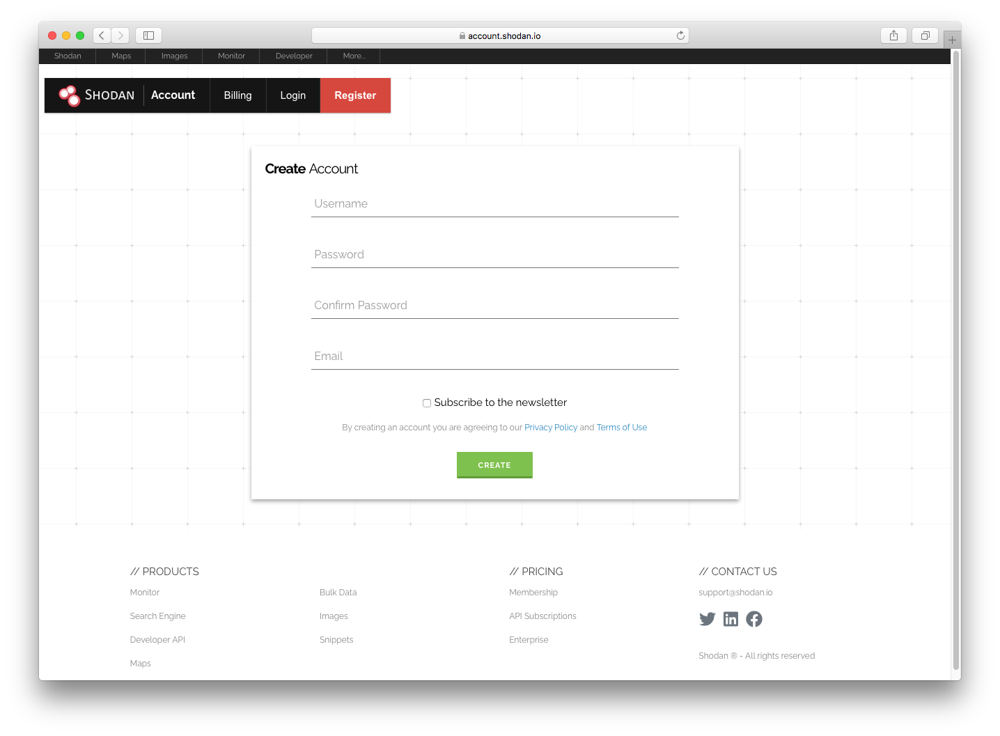
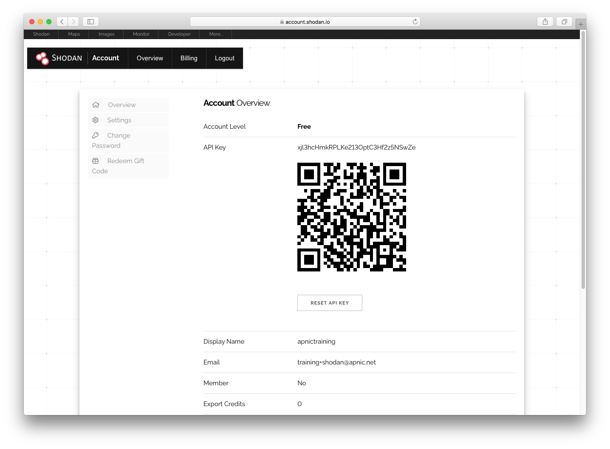
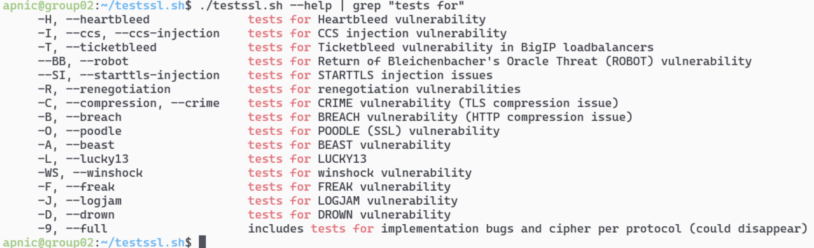

# LAB: Research TLS using Shodan and other tools
* In this example we are using apnictraining.net as domain name.
* \# super user command.
* $ normal user command.
* Username `apnic` and password `training`.

## Topology
Download the repo and change the permissions on all the shell scripts to allow it to be run. eg:
``` bash
[group1.apnictraining.net] [192.168.30.1]
[group2.apnictraining.net] [192.168.30.2]
......
[group10.apnictraining.net] [192.168.30.10]
[group11.apnictraining.net] [192.168.30.11]
......
[group20.apnictraining.net] [192.168.30.20]
[group21.apnictraining.net] [192.168.30.21]
......
[group30.apnictraining.net] [192.168.30.30]
```
In this lab you utilise various tools to research the versions of SSL and TLS that could be reachable via the internet. All of the below tasks and commands have been tested and work on Ubuntu 18.04.

Usage of all tools in this lab for profiling SSL and TLS on websites or targets without prior mutual consent is illegal. It is your responsibility to obey all applicable local, state and federal laws. APNIC assume no liability and are not responsible for any misuse or damage caused by the materal in this lab.

# Lab Tasks
Step 1: Install Shodan CLI
Step 2: Create an account on Shodan.io and generate API key
Step 3: Research TLS deployments
Step 4: Review TLS settings for a website

### <a name="fenced-code-block">Requirements</a>
1. Login to the server:
```bash
ssh apnic@192.168.30.XX
```
password is `training`

2. Install pre-requisite software
```bash
sudo apt update
sudo apt install -y python python3 python-setuptools python3-setuptools python-pip python3-pip
```

## Using Shodan
1. Install shodan cli
```bash
sudo pip install shodan
```
2. In a browser register an account at http://account.shodan.io/register



3. Click on Account to see a quick response (QR) code and the Application Programming Interface (API) key



4. Return to the VM and initialise shodan API key
```bash
shodan init <Your API Key>
```
5. Confirm shodan is installed and working
```bash
shodan -h
```
6. Get an overview of how many installations per version of SSL and TLS by country
```bash
shodan stats --facets ssl.version country:AU
```
**NOTE** For more detail on generating statistics refer to [https://help.shodan.io/command-line-interface/3-stats](https://help.shodan.io/command-line-interface/3-stats)

7. Compare the HyperText Transfer Protocol (HTTP) by product and country for SSLv2.
```bash
shodan stats --facets product country:AU ssl.version:sslv2 HTTP
```

8. There is an option to query by vulnerability, but this requires a paid small business account or academic subscription. However, facets will show statistics about verified vulnerabilities.
```bash
shodan stats --facets vuln.verified http
shodan stats --facets vuln.verified https
```

9. To query by facets in a web browser, try opening the following urls.
   
[https://beta.shodan.io/search/facet?query=port%3A443&facet=ssl.version](https://beta.shodan.io/search/facet?query=port%3A443&facet=ssl.version) <br>
[https://beta.shodan.io/search/facet?query=ssl.version%3Atlsv1&facet=vuln.verified](https://beta.shodan.io/search/facet?query=ssl.version%3Atlsv1&facet=vuln.verified)

11. To find out details about Common Vulnerabilities and Exposures (CVE), do some research on CVE-2021-26858 , try opening the following urls.

[https://cve.mitre.org/cgi-bin/cvename.cgi?name=CVE-2021-26858](https://cve.mitre.org/cgi-bin/cvename.cgi?name=CVE-2021-26858) <br>
[https://www.google.com/search?q=cve-2021-26858](https://www.google.com/search?q=cve-2021-26858)

## Review TLS settings for a website
1. To review TLS settings for a website, install some tools that can be used for testing.
```bash
sudo apt-get install -y openssl curl nmap sslscan
```

2. Confirm the use of TLS:
```bash
curl -vvI --insecure https://wiki.apnictraining.net
```

3. To view the certificate used by the website, type the following command:
```bash
openssl s_client -showcerts -connect wiki.apnictraining.net:443 </dev/null
```

4. To view the cipher in use by the website, type the following command:
```bash
openssl s_client -connect wiki.apnictraining.net:443 </dev/null | grep Cipher
```

5. Open a web browser and do a search for the cipher that is in use. For example to locate details about `TLS_AES_256_GCM_SHA384` try the following url.
6. 
[https://ciphersuite.info/search/?q=TLSAES256GCMSHA384&cat=cs](https://ciphersuite.info/search/?q=TLSAES256GCMSHA384&cat=cs)

7. Use nmap to show all the supported ciphers and the certificate of the website, by typing the following commands:
```bash
nmap --script ssl-enum-ciphers -p 443 wiki.apnictraining.net
nmap --script ssl-cert -p 443 wiki.apnictraining.net
```
**Note**: For more detail about nmap scripts. Refer to:

[https://nmap.org/nsedoc/scripts/](https://nmap.org/nsedoc/scripts/) <br>
[https://nmap.org/nsedoc/scripts/ssl-enum-ciphers.html](https://nmap.org/nsedoc/scripts/ssl-enum-ciphers.html) <br>
[https://nmap.org/nsedoc/scripts/ssl-cert.html](https://nmap.org/nsedoc/scripts/ssl-cert.html)

**HINT**: To display the supported MACs (Message Authentication Code), Ciphers, Key length and KexAlogrithms supported by SSH on the local system
```bash
nmap -vv --script=ssh2-enum-algos.nse localhost
```

7. To combine all the above searches as one command, the sslscan tool can be used to query the website. Type the following command to complete all the tests:
```bash
sslscan --help
sslscan wiki.apnictraining.net
```

**Note**: The sslscan tool can be used to query SSL/TLS services (such as HTTPS) and reports the protocol versions, cipher suites, key exchanges, signature algorithms, and certificates in use. This helps to understand which parameters are weak from a security standpoint.

## Using testssl.sh

1. To do a more complete test, install the `testssl.sh` script, by typing the following commands:
```bash
# Install the pre-requisites
sudo apt-get install -y git bsdmainutils dnsutils

# Clone the git repo
git clone --depth 1 https://github.com/drwetter/testssl.sh.git --branch 3.0

# Run the script
cd testssl.sh/
./testssl.sh wiki.apnictraining.net
```

2. The testssl.sh script can also be used to test for different TLS vulnerabilites. For example to test for **CRIME (CVE-2012-4929)** and **HEARTBLEED (CVE-2014-0160)**, type the following commands:
```bash
# Display a list of tests
./testssl.sh --help | grep "tests for"

# Testing for CRIME (CVE-2012-4929)
./testssl.sh --crime wiki.apnictraining.net

# Testing for HEARTBLEED (CVE-2014-0160)
./testssl.sh --heartbleed wiki.apnictraining.net

# Testing for both at the same time
./testssl.sh --crime --heartbleed wiki.apnictraining.net
```


**END OF EXERCISE**
