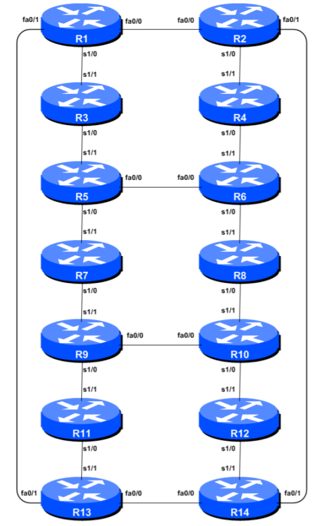

# Install Packages for Routing workshop
## Requirements
This script is designed to work on Ubuntu 18.04 LTS. It should be run under root (not suitable for a production environment).

### Cisco IOS image file
The dynamips for this workshop requires a cisco 7200 IOS image file to be located in an images folder.

```
cd ~/virtual_labs/images
ls -lash
```
If there is no file, please download from cisco before trying to start the dynamips lab
https://www.cisco.com/c/en/us/support/routers/7200-series-routers/tsd-products-support-series-home.html

## Actions Performed
* Update Packages
* Install SSH
* Install Screen
* Install Dynamips
* Install Dynagen
* Enable IPv6 and IPv4 Forwarding
* Copy dynamips routing toplogy files to virtual_labs folder
* Configure post-routing rules [optional]
* Add iptable rules [optional]

## Installation
Change to root user (if necessary) and clone Git repository:
```
cd ~
git clone https://github.com/githubapnic/Ubuntu.git
```
Enter the new directory, change variables , update permissions, and run setup_routing_workshop.sh, answer the questions:
```
cd ~/Ubuntu/workshops/routing
vi setup_routing_workshop.sh
chmod 744 setup_routing_workshop.sh
sudo ./setup_routing_workshop.sh
```

## Topology diagram


## Troubleshooting
There is an install.log file. To view the file when running the script
```
tail -f install.log
```
## Acknowledgement
The topology file is based on the workshop material by Dr. Philip Smith available at [BGP4ALL](http://www.bgp4all.com/dokuwiki/workshops/start) under a Creative Commons Attribution-Share Alike 4.0 International. Full terms at https://creativecommons.org/licenses/by-nc-nd/4.0
